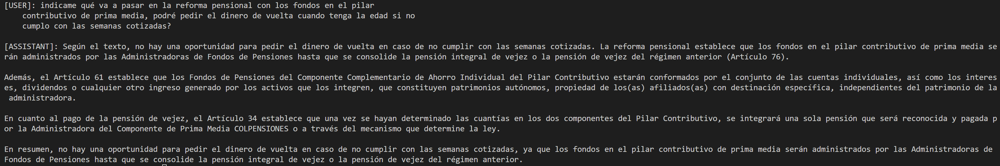
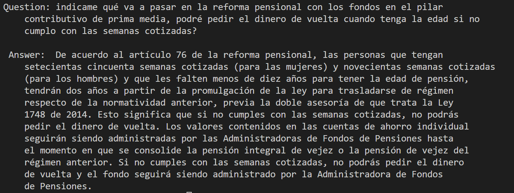

# Reforma Pensional QA using Llama 3 (8B-Instruct) and RAG (HF | Langchain+FAISS+HF)

## 🪒 Setup

Using conda or virtualenv install the packages.

```bash
conda create --name <YOUR_ENV_NAME> python=3.10
conda activate <YOUR_ENV_NAME>
pip install -r requirements.txt
```

Make sure you have at least 12 GB of VRAM.

## 🐍 Usage


### Data preprocessing

Textract was used to get text chunks based on a particular string. These are also saved to a HuggingFace dataset. See [link](https://huggingface.co/datasets/jhonparra18/reforma-pensional-col)

For more details see ```src/preprocessing.py```

### Inference
- HuggingFace
See ```src/inference_hf.py```



- Langchain
See ```src/inference_langchain.py```




### Demo

WIP

## 🤿 Contributing to this repo

- This repo uses pre-commit hooks for code formatting and structure. Before adding|commiting changes, make sure you've installed the pre-commit hook running `pre-commit install` in a terminal. After that changes must be submitted as usual (`git add <FILE_CHANGED> -> git commit -m "" -> git push `)

- For dependencies, [pip-tools](https://github.com/jazzband/pip-tools) is used. Add the latest dependency to the requirements.txt and run  `pip-compile requirements.txt -o requirements.txt` to make sure the requirements file is updated so we can re-install with no package version issues.
